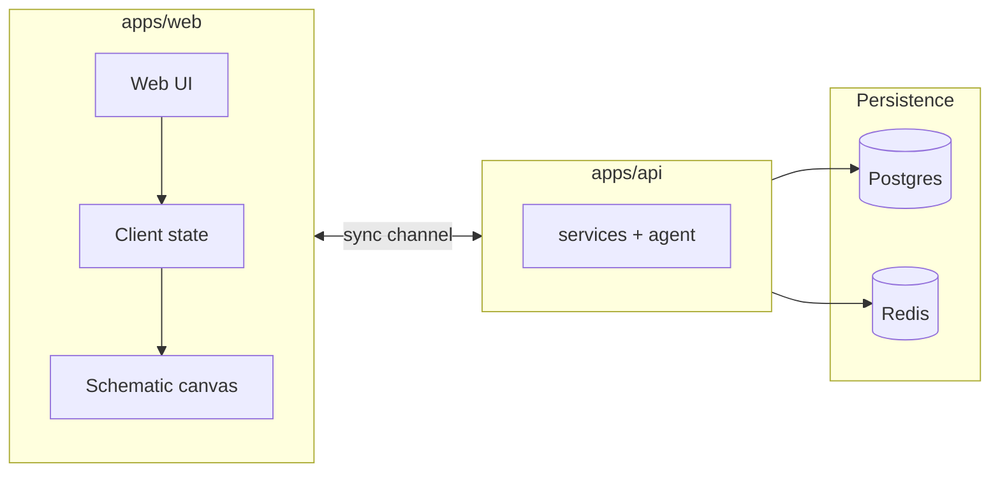

# CircuitMind

CircuitMind is a tool for an AI-assisted schematic editor. You describe intent in natural language; a tool loop mutates a single **circuit IR**; the web client renders that IR in the browser (symbols, wires, pan/zoom) and runs **browser-side auto-layout** when the graph changes. A relational **parts catalog** backs the palette—search, full catalog browse, and drag-and-drop onto the sheet so MPN, value, and footprint class stay aligned with what you place.

Shell layout: project and prompt on the left, schematic plus a PCB-style 3D strip in the center, properties and net list on the right, export in the header.


---

## Electrical and data model

### Nets and connectivity

A **net** is an equipotential: every pin tied to that net is the same electrical node. In the IR, each `Net` has a name, a **class** (`signal`, `power`, `ground`), and an optional expected **voltage** in volts for documentation or downstream checks—not for automatic KCL.

Each `Component` carries a **pin map**: logical pin name → net name (e.g. `1` → `VIN`, `2` → `GND`). **Wires** are explicit edges between `(component_id, pin)` pairs and carry the same net label; the canvas draws polylines between symbol pin coordinates, optionally using stored `path` points after layout. Unplaced palette parts may start with empty pin maps until you connect them.

Power and ground nets matter for **layout**: the hierarchical pass treats `power` / `ground` nets differently from `signal` when it builds a pseudo-topology from “who shares a net,” so sources tend to sit in an early horizontal band and loads propagate to the right. That is a drawing heuristic, not a solver.

### Components and reference designators

Components use human-style **refs** (`R1`, `C3`, `U1`, `Q1`) generated from **type** (resistor → `R`, capacitor → `C`, MOSFET/BJT → `Q`, regulator/IC/op-amp → `U`, and so on). The **value** field is the engineer-facing string: `10k`, `100nF`, `AMS1117-3.3`, `2N7002`—whatever the symbol and BOM expect. **Package** is the footprint family (`0402`, `SOT-23`, `SOIC-8`, …). Optional **part_number** / catalog **MPN** land in IR metadata for traceability.

**Rotation** is quantized to 0°, 90°, 180°, 270°; geometry in the symbol file is authored in the default orientation and the canvas group applies rotation.

Supported **categories** in the type system include passives, diodes, LEDs, BJT/MOSFET, op-amps, linear regulators, crystals, connectors, switches, fuses, and transformers—see `packages/circuit-ir` for the authoritative enum. The on-screen glyph comes from a small **symbol registry** (lines, rects, arcs, text) plus a per-type pin coordinate map so wires terminate at the right physical pin on the symbol.

### Simulation (ngspice)

The IR is lowered to a **SPICE netlist**, then run with **ngspice** in batch mode (`NGSPICE_PATH` overridable). Declared analysis types in the contract are **DC**, **AC**, and **transient**; what actually runs depends on the netlist builder and the circuit content. Successful DC runs yield a per-net voltage table (parsed from `v(netname) = …` lines in ngspice text output). If the binary is missing, the pipeline returns a clear skip/warning rather than failing the whole session.

### Catalog vs schematic

The **seeded catalog** holds manufacturer records: MPN, description, `type`, `value`, `package`, and a JSON **specs** bag (tolerance, voltage rating, etc.). Dragging from the palette instantiates a schematic `Component` with matching type/value/package and optional MPN in `properties`; connectivity is still yours to wire or to delegate to the assistant.

---

## What ships in the product

- **Natural-language edits** against the same IR the canvas uses; streamed progress and patch application in the client.
- **Schematic capture** with grid, selection, symbol drag, stage pan/zoom, and palette drop with coordinate mapping into stage space.
- **Auto-layout**: layered placement from shared-net topology, then force-directed refinement with **pins** so user-moved and freshly dropped parts are not overwritten blindly.
- **Parts palette**: debounced search over catalog text, separate “all parts” load, client-side filter on the long list, HTML5 drag payload carrying type/value/package/MPN.
- **Properties** panel bound to selection (ref, type, value, package, coordinates).
- **3D strip** in the editor (placeholder depth for board preview; richer STEP/VRML is roadmap).
- **Export** path from IR toward interchange formats (in-app export flow and server-side export).
- **Infra**: Compose stacks for databases, app processes, and optional reverse proxy—details in `infra/docker-compose.yml` and `DEVELOPMENT.md`.

---

## arch



**IR as contract:** Type definitions in `packages/circuit-ir` and the server-side mirror should describe the same objects (`Circuit`, `Component`, `Net`, `Wire`, patches, simulation results). The web store normalizes incoming JSON (wire alias fields, missing keys) before the schematic view reads it.

**Patch path:** RFC 6902-style patches apply to the in-memory circuit; layout hooks observe **component count** (and pin-based layout reads the latest graph).

### Repository map

```
circuitmind/
├── apps/web/              # Editor UI, symbols, hierarchical + force-directed layout
├── apps/api/              # Agent, simulation, export, persistence
├── packages/circuit-ir/   # Shared circuit schema
├── infra/                 # Compose, nginx, Postgres init SQL
├── scripts/               # Catalog seed
├── docs/editor.png        # Hero screenshot
├── DEVELOPMENT.md         # Commands, Compose, Phase 2 checklist
└── turbo.json             # Root dev/build task graph
```

---

## Configuration (high level)

Copy `.env.example` to `.env`. Keep real secrets out of git (`.gitignore` covers `.env`, build artifacts, virtualenvs, dependency installs, and web build output).

You need a working LLM configuration (cloud or local), database and Redis URLs consistent with however you run Docker, and the public base URLs the browser uses to reach the backend—see `.env.example` field names.

---

## Configuration

Copy `.env.example` to `.env`. Keep real secrets out of git (`.gitignore` covers `.env`, build artifacts, virtualenvs, dependency installs, and web build output).

You need database and Redis URLs consistent with however you run Docker, and the public base URLs the browser uses to reach the backend—see `.env.example` field names.

### Language models (Anthropic and Ollama)

The schematic agent runs against whichever backend **`LLM_PROVIDER`** selects (`anthropic` by default, or `ollama` for a local daemon).

| Provider | When to use | Configuration |
|----------|-------------|----------------|
| **Anthropic** | Hosted Claude with tool use over your API key | `LLM_PROVIDER=anthropic`, `ANTHROPIC_API_KEY=…`. Default model id in server settings is **`claude-opus-4-6`**; set **`CLAUDE_MODEL`** in `.env` to pin another Claude identifier if your account or policy requires it. |
| **Ollama** | Offline / LAN models you serve yourself | `LLM_PROVIDER=ollama`, **`OLLAMA_BASE_URL`** (default `http://localhost:11434`), **`OLLAMA_MODEL`** (example in `.env.example`: **`llama3.2`**). Pull the tag on the host (`ollama pull <name>`) before starting the API. |

Switching provider is a config change only; the tool surface presented to the model stays the same.

---


## Local development

Prerequisites: **Node 20+**, **Python 3.12+**, **Docker** if you use the bundled Postgres/Redis.

1. Copy `.env.example` → `.env` and fill keys/passwords.  
2. Start Postgres and Redis (`infra` Compose).  
3. API: create a venv in `apps/api`, `pip install -e ".[dev]"`, run `scripts/seed_components.py`, start the ASGI server on port 8000.  
4. Web: `apps/web`, `npm install`, `npm run dev` → http://localhost:3000  

Full stack Compose, Alembic notes, and port layout: **`DEVELOPMENT.md`**.

---

## Testing

```bash
cd apps/api && pytest tests/ -v
```

Root: `npm run lint` and `npm run type-check` where the workspace wires them up.

---

## Troubleshooting

| Symptom | Likely cause |
|---------|----------------|
| DB auth errors after changing Docker passwords | Env URL and container secrets out of sync—reconcile `.env` with `infra/.env`. |
| Canvas / `canvas` error during server render | Schematic route must load the sheet only on the client (no server-side render of the drawing surface). |
| Empty palette | Catalog not seeded, or browser cannot reach the configured backend host. |
| Part snaps away after drop | Layout must treat palette drops as pinned with preserved coordinates for that refdes pass. |

---


 

